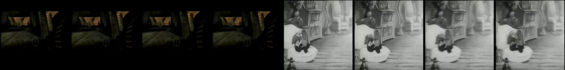
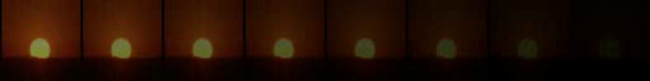

# film_edit_detection
Automatic film comprehension has recently gained increased attention due to the rapid development of the streaming services and the need to reduce manual processing of video content. During this project, we aspire to work upon the shot boundary detection problem which is of high importance for various other tasks such as movies retrieval, indexing and summarization. Our goal is to detect the transition between the consecutive shots and at the same time to identify the type of cut (e.g. gradual, abrupt). Compared to the majority of the existing works, we aim to work on historical films, with damaged or low-quality video data, which makes the cuts identification task particularly challenging.

## Synthetic Audio-Visual Dataset

Construction of synthetic Audio-Visual dataset. Our module generates 
artificial cuts (e.g. hard, dissolve, fade in/out) using both visual and audio data. 

```
pip install -r requirements.txt
cd data/syn_data
python3 audio_visual_synthesis.py [-h] video_path annotation_path output_path num_frames N
```

### Examples of Generated Samples





## Shot Boundary Detection

Predict the transitions of a given video file using the deepSBD [1] network (based on the C3D [2]). Model checkpoints can be found [here](https://drive.google.com/file/d/1Rd7ij3o9pD0UpAQdfLJIkFVeoOdC1n3Y/view?usp=sharing).The results are saved on a json file at the output path.

```
python3 main.py [-h] video_path output_path
```


[//]: # (### Trained SBD Model results)


[//]: # ()
[//]: # (|  Model  | RAI  |  BBC  |)

[//]: # (|:-------:|:----:|:-----:|)

[//]: # (| DeepSBD | 0.87 | 0.9 |)


## Singularity Envorinment


1. Connect to CWRU HPC

```
ssh user@rider.case.edu
```


2. Request a GPU node

```
cd /mnt/rds/redhen/gallina/home/
srun -p gpu -C gpu2080 --gres=gpu:1 --pty bash
```


4. Load singularity module

```
module load singularity
```


5. Run Modules

```
cd /tmp/$USER/
git clone https://github.com/apapoudakis/film_edit_detection.git
cd film_edit_detection
rsync -az hpc3:/mnt/rds/redhen/gallina/home/axp1083/safe/singularity/sbd_img.sif /tmp/axp1083/film_edit_detection/
singularity shell --nv sbd_img.sif 
python3 main.py [video_path] [output_path]
```

[//]: # ()
[//]: # (## References)


###
## Future Work
- Audio-Visual Network (ResNet50 and PSD) [3]


## References

[1] A. Hassanien, M. Elgharib, A. Selim, M. Hefeeda, and
W. Matusik. Large-scale, fast and accurate shot boundary
detection through spatio-temporal convolutional neural networks. 

[2] D. Tran, L. Bourdev, R. Fergus, L. Torresani, and M. Paluri, Learning
spatiotemporal features with 3d convolutional networks.

[3] Bouyahi Mohamed and Yassine Ben Ayed. Multimodal features for shots boundary detection. 

[4] Shitao Tang and Litong Feng and Zhanghui Kuang and Yimin Chen and Wayne Zhang. Fast Video Shot Transition Localization with Deep Structured Models.