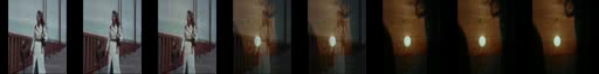
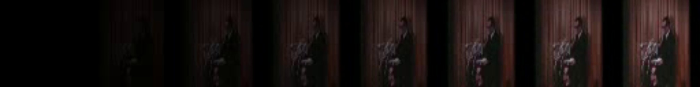
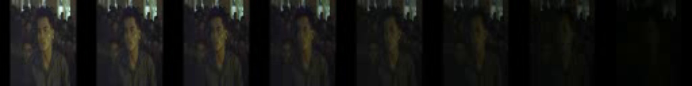

# film_edit_detection
Automatic film comprehension has recently gained increased attention due to the rapid development of the streaming services and the need to reduce manual processing of video content. During this project, we aspire to work upon the shot boundary detection problem which is of high importance for various other tasks such as movies retrieval, indexing and summarization. Our goal is to detect the transition between the consecutive shots and at the same time to identify the type of cut (e.g. gradual, abrupt). Compared to the majority of the existing works, we aim to work on historical films, with damaged or low-quality video data, which makes the cuts identification task particularly challenging. 


## Synthetic Audio-Visual Dataset

Construction of synthetic Audio-Visual dataset. Our module generates 
artificial cuts (e.g. hard, dissolve, fade in/out) using both visual and audio data. 

```
pip install -r requirements.txt
cd data/syn_data
python3 audio_visual_synthesis.py [-h] video_path annotation_path output_path num_frames N
```

### Generated Samples




## Shot Boundary Detection

 

```
python3 main.py [-h] video_path output_path
```


###


[//]: # (### Trained SBD Model results)


[//]: # ()
[//]: # (|  Model  | RAI  |  BBC  |)

[//]: # (|:-------:|:----:|:-----:|)

[//]: # (| DeepSBD | 0.87 | 0.9 |)


[//]: # (## Singularity Envorinment)

[//]: # ()
[//]: # (1. Connect to CWRU HPC)

[//]: # (```)

[//]: # (ssh user@rider.case.edu)

[//]: # (```)

[//]: # ()
[//]: # (2. Request GPU node)

[//]: # (```)

[//]: # (module load singularity)

[//]: # (```)

[//]: # ()
[//]: # (4. Load singularity module)

[//]: # (```)

[//]: # (module load singularity)

[//]: # (```)

[//]: # ()
[//]: # (5. Run Modules)

[//]: # (```)

[//]: # (singularity exec --nv first_version.sif python3 train_xor.py)

[//]: # (```)

[//]: # ()
[//]: # (## References)

